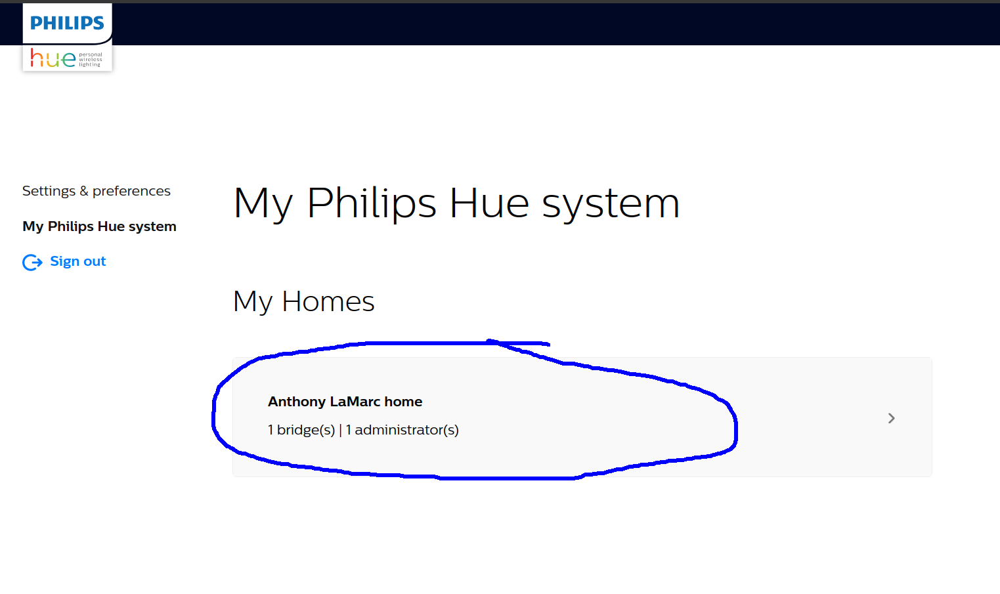

# hue

## Hard reset instructions

If controlling bulbs from UrbHue stops functioning,
start by unlinking the bridge.  Here's how to do that:

1. Navigate to the `logs` tab inside hue, and click on `unlink`.


2. Login to the Philips website, and click into your home:



3. Scroll down to "applications" and revoke access for `urbhue` and `UrbHue`:


4. That's it for the Philips side.  Back on Urbit, open up the terminal (use webterm if hosted) and run the following commands:

```hoon
~zod:dojo> |nuke %hue
~zod:dojo> |revive %urbhue
```

1. Reopen the UrbHue application, and you should be prompted to redo the setup process.